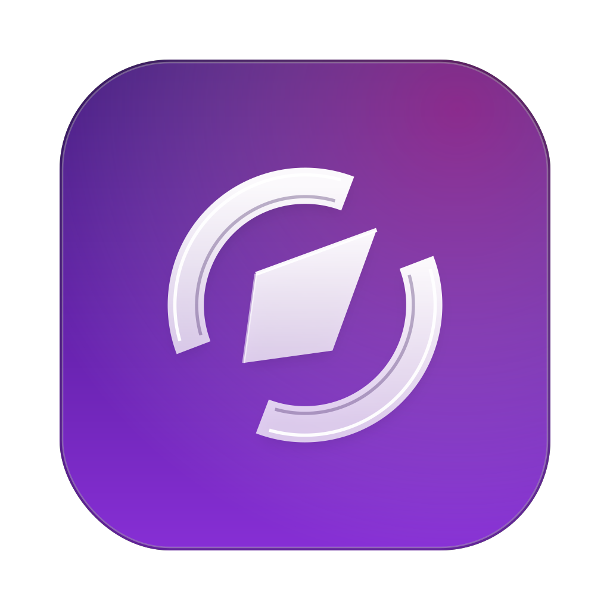

<p align="center">
  <a href="https://browxai.com"></a>
</p>

<h1 align="center">browxai</h1>

<p align="center"><strong>A browser, built for agents.</strong><br/>
<a href="https://browxai.com">browxai.com</a> · <a href="brand/">brand kit</a></p>

**An MCP-native, model-agnostic, agentic-first browser-control server for AI agents.**

browxai gives an AI agent a curated, token-efficient browser surface over the
Model Context Protocol — Playwright/CDP under the hood, a tool surface designed
for agents rather than for human developers, and headless/CI-capable.

It is deliberately **not** a wrapper over `@playwright/mcp`: browxai owns its
own Playwright/CDP transport so it can own the full session lifecycle —
managed profiles, attach-to-an-existing-Chrome (BYOB), authenticated
sessions, headed and headless — and shape an agent-first surface around it.

- **Model-agnostic** — any MCP client (Claude, Codex, …), not locked to one model.
- **Token-efficient** — `snapshot()` is a compact accessibility tree + DOM-walk, not a DOM dump; results are scoped/paginated/budgeted.
- **Safe by default** — capability-gated tools, an origin allow/blocklist, confirmation hooks, a hard anti-wedge deadline on every call. Dangerous surface (arbitrary JS, full response bodies, OS clipboard, network mocking) is off by default.

## Install

```bash
npm install -g browxai
npx playwright-core install chromium    # one-time, ~150 MB
```

Wire it into an MCP client (stdio transport) — e.g. in an `.mcp.json`:

```jsonc
{
  "mcpServers": {
    "browxai": { "command": "browxai" },
  },
}
```

## SDK (programmatic surface)

For consumers that author a single TypeScript script and run it
autonomously, browxai also ships a typed SDK. Same tool registry, same
capability gates, same egress hygiene — different transport.

```ts
import { createBrowxai } from "browxai";

const browxai = await createBrowxai(); // in-process, single-script
await browxai.navigate({ url: "https://example.com" });
const { data } = await browxai.extract({
  schema: {
    /* … */
  },
});
await browxai.close();
```

Three transports:

- **In-process** (default) — single Node process; the SDK drives the server
  in-process. `close()` shuts the embedded server.
- **Stdio child** (`transport: "stdio-child"`) — spawns the `browxai` bin as
  a subprocess and speaks MCP-over-stdio. `close()` ends the child.
- **Socket-attached** (`endpoint: "unix:///tmp/foo.sock"`) — connects to a
  long-running `browxai serve --socket /tmp/foo.sock` process. Multiple
  clients can attach to ONE server (e.g. a parent agent plus a child script
  sharing one Chromium). `close()` ends only the local connection.

Capability gates apply identically to the MCP path: posture-broadening
tools (`eval_js`, `network_body`, `register_secret`, `upload_file`, …) are
**off by default** and only appear on the client when their capability is
named in `createBrowxai({ capabilities })`. Calling a non-exposed tool —
even via `client.callTool("eval_js", …)` — fails with a
`BROWXAI_SDK_NOT_EXPOSED` error before any wire dispatch.

## Harness setup

Ready-to-use setup for the common agent harnesses — MCP-server registration
plus a portable "driving browxai well" Agent Skill — lives in
**[`harness/`](harness/)**: [Claude Code](harness/adapters/claude-code/),
[Codex](harness/adapters/codex/), [Pi](harness/adapters/pi/).

## The surface

- **`snapshot`** — compact accessibility tree + DOM-walk pass; every node gets a stable `[ref=eN]`.
- **`find`** — natural-language query → ranked candidate locators with `selectorHint`, `stability`, visible-rect `bbox`, and an `actionable` verdict.
- **action tools** (`click` / `fill` / `navigate` / `select` / `wait_for` / …) — each returns a structured `ActionResult`: what navigated, what structure changed, console/network slice, a post-action element probe.
- **read tools** — `text_search`, `inspect`, `console_read`, `network_read`, `ws_read`, `screenshot`.
- **sessions** — isolated per-session contexts (own cookie jar / refs); `persistent`, `incognito`, or `attached` (BYOB) modes; MCP-driven config.
- **capabilities** — `read,navigation,action,human` on by default; `eval`, `network-body`, `clipboard`, `file-io`, and `byob-attach` are explicit opt-ins.

Full per-tool reference, the security model, and the stability policy are in the
**[documentation site](https://browxai.com/)**.

## Stability

browxai is **v0.7.0** and follows semver. The public tool surface (tool names,
documented input/output shapes, the `ActionResult` shape, the default
capability set) is frozen; anything behind an off-by-default capability is
explicitly experimental and not covered by the stability guarantee. See the
[Stability and semver](https://browxai.com/reference/tool-reference/#stability-and-semver) policy.

## Develop

```bash
corepack enable && pnpm install
pnpm install-browser     # Chromium for playwright-core
pnpm typecheck && pnpm test
pnpm build               # builds dist/ — the `browxai` bin is dist/cli.js
pnpm test:keystone       # headless end-to-end keystone (real Chromium)
pnpm docs:dev            # the documentation site, locally
```

## Project docs

- [CONTRIBUTING.md](CONTRIBUTING.md) — contributor workflow + DCO.
- [AGENTS.md](AGENTS.md) — operating rules for AI-harness contributors.
- [SECURITY.md](SECURITY.md) — vulnerability reporting + disclosure policy.
- [MAINTAINERS.md](MAINTAINERS.md) — maintainer roster + responsibilities.
- [RELEASING.md](RELEASING.md) — release ritual + OIDC publish flow.
- [CODE_OF_CONDUCT.md](CODE_OF_CONDUCT.md) — Contributor Covenant adoption.

## License

Code is MIT — see [LICENSE](LICENSE).

The **browxai name and logo are trademarks of Kalebtec** and are not
covered by the MIT License. The brand assets under [`brand/`](brand/)
are all-rights-reserved (see [`brand/LICENSE`](brand/LICENSE)). See
[TRADEMARKS.md](TRADEMARKS.md) for the full brand policy and what
nominative use is allowed.
