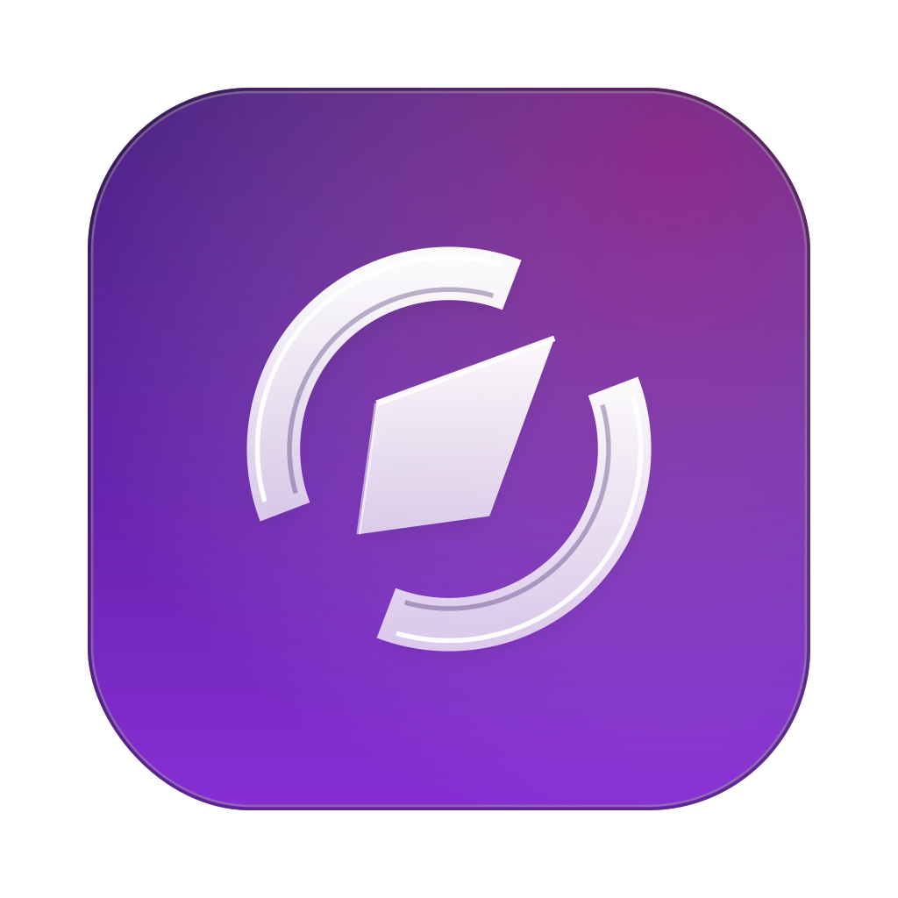

<p align="center">
  <a href="https://browxai.com"></a>
</p>

<h1 align="center">browxai</h1>

<p align="center"><strong>The same tools for a web page and a native app.</strong><br/>
<a href="https://browxai.com">browxai.com</a> · <a href="brand/">brand kit</a></p>

**Give your AI agent a real browser it can navigate, read and act on, over the Model Context Protocol or a typed TypeScript SDK. On your machine, or on an Android phone plugged into it. The same `find` and `click` drive a native app on an Android emulator or the iOS Simulator, and the UI of a desktop Electron app you already have open. The engines past a managed browser, and a short reach onto your host machine, are off until you switch them on.**

browxai is a control server designed for agents. A browser is what it drives most. Point any MCP client (Claude Code, Codex, Pi, …) or a single TypeScript script at it, and your agent gets a compact, safe set of tools (navigate, find, click, fill, read, screenshot) that return small, structured results. It works with any model, and it keeps the dangerous powers off until you turn them on.

Eight engines sit behind that one tool surface, in three families. They are not three equally proven things. Each paragraph below says how far its evidence goes.

**Five browser engines.** Chromium, Firefox and WebKit are browsers browxai launches for you. `safari` drives real Safari.app over `safaridriver`. `android` drives real Chrome on an Android handset attached over adb. It is attach-only: the browser has to already be running on the device, and a managed launch refuses with `android-launch-not-supported`. CI runs the cross-engine suite on Chromium, Firefox and WebKit on every commit; Android needs a USB device and Safari needs macOS, so those two are exercised by hand.

**Two native-app engines**, both behind the off-by-default `native-device` capability, which `open_session` checks before anything boots, installs or launches. Neither is a browser: no DOM, no URL, and `eval_js`, the network family and web storage all refuse by name. What each app does return is the same `A11yNode` tree with the same `[ref=eN]` refs `snapshot` returns for a page, so `find` and `click` work on it unchanged.

- `android-app` drives an app on an Android emulator through UiAutomator, over `adb`. It is verified end to end against a live Android 14 emulator: fifteen keystone cases through the real MCP server, green from a fresh boot. A device is leased, because two UiAutomator clients on one device break every hierarchy read for both.
- `ios-app` drives an app on the iOS Simulator through XCUITest. The `simctl` half of it (resolve, boot, install, launch, screenshot, terminate) runs against real simulators in the keystone. The WebDriverAgent transport it reads the hierarchy over has only ever been exercised against a stand-in HTTP server. That proves the engine registration, the ref minting, the action verbs and the tool handlers. It does not prove that a real WebDriverAgent answers those endpoints with these shapes.

WebDriverAgent, Xcode and the Android SDK are yours to install and run. browxai bundles none of them, creates no AVD and no simulator, and a missing WebDriverAgent refuses session creation instead of answering `snapshot` with an empty tree.

**One desktop-app engine.** `electron` attaches to a running Electron application over the `--remote-debugging-port` it was launched with, so VS Code or Slack is in reach. It works because an Electron app is Chromium: the engine reuses the same substrate bundle the Chromium engine uses and adds no new capture code. It differs from an ordinary BYOB attach in three ways the keystone measures. It is attach-only, and `electron-launch-not-supported` says so; browxai will not start a desktop application. `navigate` refuses, because loading a URL into an Electron renderer would run that page inside the application's own privileged renderer. A single-window app exposes one page target and cannot mint another, so a second session refuses with `attach-target-creation-unavailable`. The gate is `byob-attach`, the same one a BYOB Chrome needs, and the debugging port is unauthenticated for the app's lifetime: read [`docs/threat-model.md`](docs/threat-model.md) before pointing it at an app that holds your data.

The Electron evidence is one app, on one machine, in one run: VS Code 1.122.1 on Electron 39.8.8, where `snapshot` returned a 132-line tree in 36 ms, `find` ranked three real candidates with bounding boxes, and a `click` by ref landed. Attachability is a property of the app and the version, and browxai cannot promise it. Figma's desktop client calls `app.commandLine.removeSwitch("remote-debugging-port")` at startup, read out of the shipped `app.asar` of 126.8.18 on macOS, so it never opens a port and there is nothing to attach to. Check the app you actually have.

Simulators, emulators and Electron only. There is no real-device lane on either mobile platform, and no native desktop automation on macOS, Windows or Linux. Electron is in scope because it is Chromium; a Cocoa, Win32 or GTK app has no CDP endpoint and stays out. Nothing here drives input or the screen outside a browser, a driven mobile app, or an Electron app you attached to.

A task rarely stays inside the tab, so browxai reaches a short way onto the host machine. Each reach sits behind its own capability, and none of them is in the default set (`read`, `navigation`, `action`, `human`):

- **The real OS clipboard** (`clipboard`). A copy or cut writes through to `pbcopy` on macOS or `xclip` on Linux, at the moment of the command and never in the background. It is write-only: browxai never reads the OS clipboard back into a session, so a session cannot pick up what you or another session put there.
- **Your password manager** (`credentials`). browxai shells out to 1Password, Bitwarden, LastPass or `oathtool` for a username and a TOTP code, with fixed argv and no shell interpolation. The password is never handed to the agent in cleartext; it is registered under an alias the runtime substitutes at dispatch.
- **A workspace on disk** (`file-io`). File reads and writes are rooted at `$BROWX_WORKSPACE` and any path escaping that root is rejected. Scope is that one directory.
- **A phone over USB.** Device discovery and port forwarding run `adb devices` and `adb forward`, and nothing else.

That is the whole of the host reach: three capabilities and adb. browxai has no general shell tool, no OS-level input outside a browser or an app it opened, and no screen capture beyond those.

## What your agent can do with it

- **Drive a live web app.** Have a coding agent `navigate` to a page, `find` a control by natural-language query, `fill` a form, `click`, and verify the outcome from a structured `ActionResult`, without burning tokens on a full DOM dump.
- **Work inside an authenticated session.** Open a `persistent` or `attached` (bring-your-own-browser) session so the agent operates inside a real, logged-in profile and can automate multi-step flows that need the existing cookies.
- **Extract structured data from a script.** From one autonomous TypeScript file: `createBrowxai()` → `navigate()` → `extract({ schema })` → `close()`, with the same safety gates as the MCP path.
- **Log in without seeing the password.** With `credentials` on, the agent asks for an account by name, browxai fetches the username and TOTP code from your vault, and `fill` submits a password the agent only ever knows by alias.
- **Run cross-engine checks.** Drive the same tool surface on Chromium, Firefox, WebKit, real Chrome-on-Android, or real Safari. Pick the engine per session and validate a flow beyond just Chromium. Chromium is the full surface; the non-CDP engines run a curated subset and **structurally refuse** the CDP-deep tools with a named reason (see the per-engine table in the [tool reference](docs/tool-reference.md)).
- **Drive a native app on an emulator.** With `native-device` on, open an `android-app` or `ios-app` session and the agent taps, types and swipes through the same `find` / `click` / `fill` it uses on a page. Ten `device_*` and `app_*` tools cover boot, install, launch and reset. A verb the platform has no primitive for refuses and names what is missing, so `gesture_pinch` works on iOS and refuses on Android.
- **Drive the desktop app you already have open.** Start VS Code or Slack with `--remote-debugging-port`, point `BROWX_ATTACH_CDP` at it, grant `byob-attach`, and `snapshot` / `find` / `click` read and drive the app's own UI. browxai names the engine `electron` off `Browser.getVersion` without being told, so an agent is never told it is driving a plain Chromium tab.
- **Run in CI without wedging.** Stand the server up headless in a pipeline; every call has a hard anti-wedge deadline, so a stuck page never hangs the run.
- **Share one browser across agents.** Run `browxai serve --socket` and attach multiple SDK clients to one long-running server (one Chromium), say a parent agent plus a helper script.

## Why browxai

- **Model-agnostic.** It works with any MCP client (Claude, Codex, …), so nothing here ties you to one model.
- **Engine-agnostic.** The same tools drive Chromium / Firefox / WebKit / Android Chrome / Safari / a desktop Electron app, each over the protocol that fits it (CDP, WebDriver BiDi, safaridriver), and the two native-app engines over UiAutomator and XCUITest. Pick with `--engine` / `BROWX_ENGINE`; the default is Chromium. Coverage is uneven and the gaps are named: navigation, actions, snapshot/find, screenshots and storage work across the browsers, while the CDP-deep family (tracing, heap, coverage, network interception) is Chromium-only and refuses elsewhere with an explicit `engine:` reason. A native session refuses more, starting with `eval_js` and the whole network family.
- **Token-efficient.** `snapshot()` returns a compact accessibility tree with stable element refs, not a DOM dump; results are scoped, paginated, and budgeted.
- **Safe by default.** Capability-gated tools, an origin allow/blocklist, confirmation hooks, and a hard per-call deadline. The dangerous surface (arbitrary JS, full response bodies, OS clipboard, password-manager lookups, workspace file IO, network mocking, attaching to your real Chrome) is off until you opt in.
- **Reaches past the browser, on your say-so.** The OS clipboard, your password manager, a workspace directory, a USB-attached phone, a native app on an emulator and a running Electron app are all in scope, each behind a capability that starts off.
- **Owns the full session lifecycle.** Managed profiles, BYOB attach, and sessions that can be authenticated, headed, or headless.

## Stability

browxai follows semver. The public tool surface (tool names, documented input/output shapes, the `ActionResult` shape, and the default capability set) is frozen and semver-governed, so you can adopt it freely and pin your version. Anything behind an off-by-default capability is explicitly experimental and not covered by the stability guarantee. See the [Stability and semver](https://browxai.com/reference/tool-reference/#stability-and-semver) policy.

## What "safe by default" does and does not mean

The capability gate, origin allow/blocklist and confirmation hooks are **policy**: they govern what the tool surface will do when an agent asks. They are not a sandbox around the process.

Two consequences worth knowing before you deploy:

- **Plugins run in-process with full Node access.** The trust tier tells you where a plugin came from; the loader treats every tier identically at runtime, and nothing intercepts a plugin's calls. Adopting a plugin is exactly as consequential as adding an npm dependency, transitive deps included. See [plugin governance](docs/plugin-governance.md).
- **The containment that contains is infrastructure.** For anything beyond driving your own machine against sites you own, run browxai in a container or VM as a non-root user with no route to your local network. [`deploy/Dockerfile`](deploy/Dockerfile) is a working starting point, and the [deployment checklist](docs/security-best-practices-for-adopters.md) is short.

Chromium's own sandbox still isolates _page_ content the whole time, which is the boundary the [threat model](docs/threat-model.md) is mostly about. The gap is between the browxai process and your host.

## Install

```bash
npm install -g browxai
npx playwright-core install chromium    # one-time, ~150 MB
```

Wire it into an MCP client over the stdio transport, e.g. in an `.mcp.json`:

```jsonc
{
  "mcpServers": {
    "browxai": { "command": "browxai" },
  },
}
```

That's it. Your agent now has a browser. For drop-in setup per harness, see [Harness setup](#harness-setup) below.

## SDK (programmatic surface)

To author a single TypeScript script and run it autonomously, browxai ships a typed SDK. Same tool registry, same capability gates, same egress hygiene, over a different transport.

```ts
import { createBrowxai } from "browxai";

const browxai = await createBrowxai(); // in-process, single-script
await browxai.navigate({ url: "https://example.com" });
const { data } = await browxai.extract({
  schema: { title: "string" },
});
await browxai.close();
```

Three transports:

- **In-process** (default). One Node process, with the SDK driving the server inside it. `close()` shuts the embedded server.
- **Stdio child** (`transport: "stdio-child"`). Spawns the `browxai` bin as a subprocess and speaks MCP-over-stdio. `close()` ends the child.
- **Socket-attached** (`endpoint: "unix:///tmp/foo.sock"`). Connects to a long-running `browxai serve --socket /tmp/foo.sock` process. Multiple clients can attach to ONE server (e.g. a parent agent plus a child script sharing one Chromium). `close()` ends only the local connection.

The same safety gates apply as on the MCP path. Tools that broaden the security posture (`eval_js`, `network_body`, `register_secret`, `upload_file`, …) are **off by default** and only appear once their capability is named in `createBrowxai({ capabilities })`, and in the server's own capability set (`BROWX_CAPABILITIES`), which gates the same tool independently. Calling a non-exposed tool, even via `client.callTool("eval_js", …)`, fails with a `BROWXAI_SDK_NOT_EXPOSED` error before anything hits the wire; a name no tool registers fails with `BROWXAI_SDK_UNKNOWN_TOOL`.

`client.callTool(name, args)` reaches **every** registered tool whose capability is active, the same surface the MCP server exposes. The typed methods on the client are a curated ergonomic subset for the tools most agent loops use; they are not a smaller allow-list.

## Harness setup

**[`harness/`](harness/)** holds ready-to-use setup for the common agent harnesses: MCP-server registration plus a portable "driving browxai well" Agent Skill. One adapter each for [Claude Code](harness/adapters/claude-code/), [Codex](harness/adapters/codex/) and [Pi](harness/adapters/pi/).

## The surface

- **`snapshot`** returns a compact accessibility tree plus a DOM-walk pass, and every node carries a stable `[ref=eN]`.
- **`find`** turns a natural-language query into ranked candidate locators with `selectorHint`, `stability`, a visible-rect `bbox`, and an `actionable` verdict.
- **action tools** (`click` / `fill` / `navigate` / `select` / `wait_for` / …) each return a structured `ActionResult`: what navigated, what structure changed, a console/network slice, and a post-action element probe.
- **read tools** cover `text_search`, `inspect`, `console_read`, `network_read`, `ws_read` and `screenshot`.
- **sessions** each get an isolated context (own cookie jar and refs), come in `persistent`, `incognito` or `attached` (BYOB) flavours, and are configured over MCP.
- **capabilities**: `read`, `navigation`, `action` and `human` are on by default; `eval`, `network-body`, `clipboard`, `file-io`, `byob-attach`, `secrets`, `extensions`, `native-device`, … are explicit opt-ins.
- **native sessions** (`android-app`, `ios-app`) answer `snapshot` and `find` from a view hierarchy instead of a DOM, and add `device_*` and `app_*` lifecycle tools.
- **an `electron` session** is Chromium over CDP, with `navigate` refused and no second page target to open.

The full per-tool reference, the security model, and the stability policy are on the **[documentation site](https://browxai.com/)**.

## For contributors

```bash
corepack enable && pnpm install
pnpm install-browser     # Chromium for playwright-core
pnpm typecheck && pnpm test
pnpm build               # builds dist/ — the `browxai` bin is dist/cli.js
pnpm test:keystone       # headless end-to-end keystone (real Chromium)
pnpm docs:dev            # the documentation site, locally
```

Three test lanes, in ascending cost. `pnpm test` is hermetic and browser-free.
`pnpm test:keystone` drives real browsers: Chromium, Firefox and WebKit in CI.
Android, Safari, the two native engines and Electron need a device, a Mac, an
emulator or a running app, so they run manually and skip cleanly when nothing is
attached. Then
`packages/capability-testbed/` is a multi-surface web app plus a harness that
drives **every** tool against it, run on demand because it needs real browsers
with every off-by-default capability switched on. The testbed lane is where the
interesting failures live. Its most recent pass went from 181/196 to 196/196 and
turned up six real defects a mocked unit test cannot see: a virtual-time race in
`clock`, a cookie path-filter mismatch, an `extract` array leaf resolving empty,
a `text_search` visibility filter discarding every match, a page-function
serialization error in `drop_files`, and `set_locale` never moving
`navigator.language`.

Project docs:

- [CONTRIBUTING.md](CONTRIBUTING.md): contributor workflow + DCO.
- [AGENTS.md](AGENTS.md): operating rules for AI-harness contributors.
- [SECURITY.md](SECURITY.md): vulnerability reporting + disclosure policy.
- [MAINTAINERS.md](MAINTAINERS.md): maintainer roster + responsibilities.
- [RELEASING.md](RELEASING.md): release ritual + OIDC publish flow.
- [CODE_OF_CONDUCT.md](CODE_OF_CONDUCT.md): Contributor Covenant adoption.

## License

Code is MIT. See [LICENSE](LICENSE).

The **browxai name and logo are trademarks of Kalebtec** and are not
covered by the MIT License. The brand assets under [`brand/`](brand/)
are all-rights-reserved (see [`brand/LICENSE`](brand/LICENSE)). See
[TRADEMARKS.md](TRADEMARKS.md) for the full brand policy and what
nominative use is allowed.
